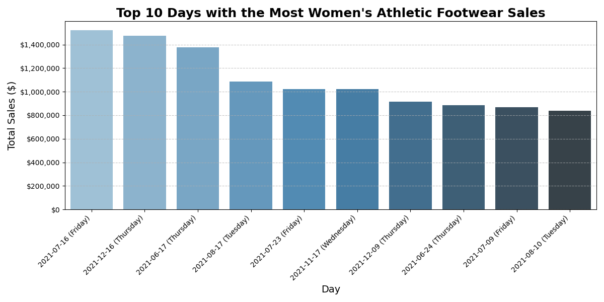
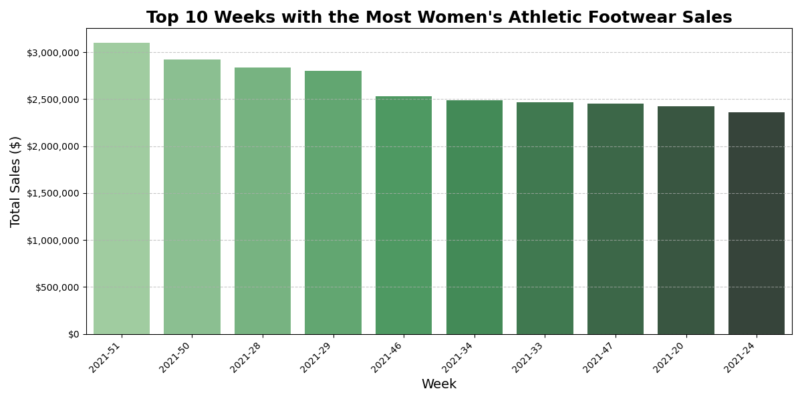
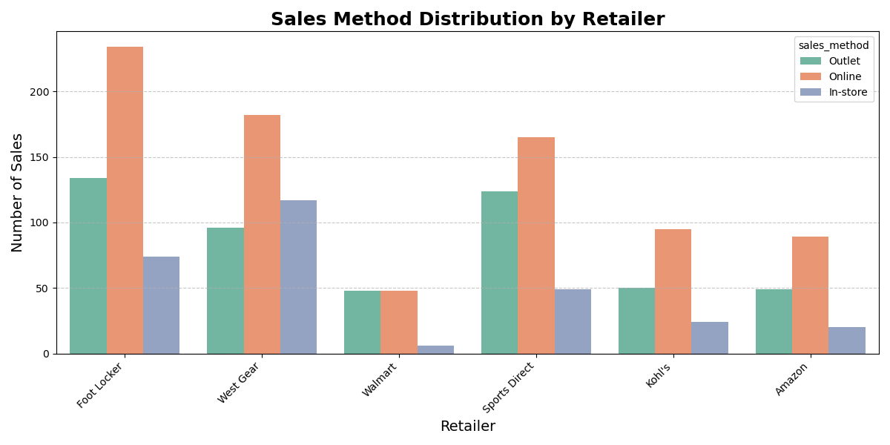
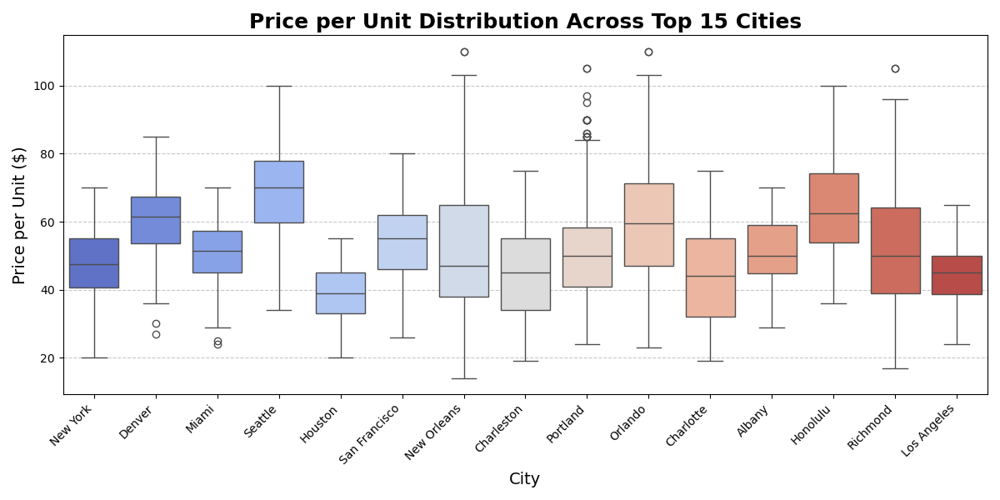
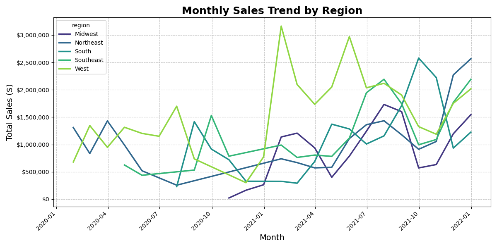
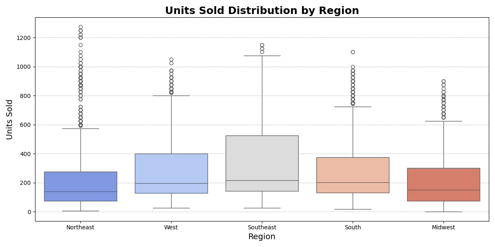

# Athletic Sales Data Analysis with Pandas


## Purpose
The **Athletic Sales Data Analysis with Pandas** program provides insights into product sales, regional performance, and retailer profitability for a fictional athletic footwear company. This project uses Python's Pandas library to explore and analyze sales data, highlighting key trends and metrics to aid business decision-making.

As a data analyst, I developed this project to enhance my skills in working with large datasets and solving real-world business problems. The project simulates a business scenario, allowing me to apply data transformation, aggregation, and visualization techniques using Python.

## Overview
The **Athletic Sales Data Analysis with Pandas** project addresses key business questions:

- Which regions and retailers generate the highest sales?
- What are the sales trends across product categories and time periods?
- Which products are most profitable, and in which regions?
- How do sales methods vary across retailers?

This project demonstrates the use of Pandas for data manipulation and Matplotlib/Seaborn for visualizations.

## Table of Contents

1. [Purpose](#purpose)
2. [Overview](#overview)
3. [Data Dictionary](#data-dictionary)
4. [Project Structure](#project-structure)
5. [Visualizations](#visualizations)
   - [Top 10 Days with the Most Sales](#top-10-days-with-the-most-sales)
   - [Top 10 Weeks with the Most Sales](#top-10-weeks-with-the-most-sales)
   - [Monthly Sales Trend](#monthly-sales-trend)
   - [Total Sales by Retailer](#total-sales-by-retailer)
   - [Sales Method Distribution by Retailer](#sales-method-distribution-by-retailer)
   - [Operating Profit by Region](#operating-profit-by-region)
   - [Price per Unit Distribution Across Top 15 Cities](#price-per-unit-distribution-across-top-15-cities)
   - [Top Products Sold by Retailer](#top-products-sold-by-retailer)
   - [Sales Trend by Region](#sales-trend-by-region)
   - [Total Sales Over Time (Daily)](#total-sales-over-time-daily)
   - [Heatmap of Sales by Region and Product](#heatmap-of-sales-by-region-and-product)
   - [Units Sold Distribution by Region](#units-sold-distribution-by-region)
   - [Total Sales by Product Category Over Time](#total-sales-by-product-category-over-time)
   - [Correlation Heatmap for Numeric Variables](#correlation-heatmap-for-numeric-variables)
6. [Use Cases](#use-cases)
7. [Technologies Used](#technologies-used)
8. [Recommendations](#recommendations)
9. [Conclusion](#conclusion)
10. [References](#references)


## Data Dictionary
The dataset contains the following columns:

| Column          | Data Type  | Description                                                   |
|-----------------|------------|---------------------------------------------------------------|
| retailer        | object     | Name of the retailer                                          |
| retailer_id     | int64      | Unique identifier for each retailer                           |
| invoice_date    | object     | Date of the sale (YYYY-MM-DD)                                 |
| region          | object     | Region where the sale occurred                                |
| state           | object     | U.S. state of the sale                                        |
| city            | object     | City where the sale occurred                                  |
| product         | object     | Product category (e.g., Women’s Athletic Footwear)            |
| price_per_unit  | int64      | Price per unit of the product                                 |
| units_sold      | int64      | Number of units sold                                          |
| total_sales     | int64      | Total sales (units_sold * price_per_unit)                     |
| operating_profit| float64    | Operating profit generated from the sale                      |
| sales_method    | object     | Method of sale (e.g., online, in-store)                       |

### Dataset Summary
- **Row Count**: 9,643 entries
- **Memory Usage**: 1 MB
- **Non-null Count**: All columns have 9,643 non-null entries
- **Data Types**: A mix of object (string), int64 (integer), and float64 (floating-point)

## Project Structure
The project includes the following:

- **Resources/**: Contains the sales datasets (`athletic_sales_2020.csv` and `athletic_sales_2021.csv`).
- **Starter_Code/**: Contains the analysis notebook and code (`athletic_sales_analysis.ipynb`).
- **Visuals/**: Includes all visualizations created during the analysis.
- **README.md**: This documentation file.

## Installation

To run this project locally, follow these steps:

1. **Clone the Repository**:
   ```bash
   git clone https://github.com/jsaintfleur/athletic-sales-analysis.git
    ```

2. **Navigate to the Project Directory**:
   ```bash
   cd athletic-sales-analysis
   ```
3. **Create a Virtual Environment (optional but recommended)**:
```bash
 python -m venv venv
source venv/bin/activate   # On macOS/Linux
venv\Scripts\activate      # On Windows
    ```

4. **Install Dependencies: Install the required Python libraries by running:**
```python
# Import Libraries and Dependencies
import pandas as pd
import numpy as np
import matplotlib.pyplot as plt
import matplotlib.ticker as mtick
from matplotlib.ticker import FuncFormatter
import seaborn as sns
 ```
5. **Launch the Jupyter Notebook: Open the project analysis notebook:**
``` bash
jupyter notebook
```
6. **Run the Analysis:** Open the `athletic_sales_analysis.ipynb` notebook and run the cells to view the analysis and visualizations.

7. **Dataset Location:** Ensure the dataset files (`athletic_sales_2020.csv` and `athletic_sales_2021.csv`) are located in the Resources/ directory.

8. **Prerequisites**
- Python 3.8 or higher
- Jupyter Notebook or JupyterLab
- A web browser to view the notebook

## Visualizations

The project generated the following visualizations to provide insights:

1. **Top 10 Days with the Most Sales**: This bar plot identifies the top 10 days with the highest sales for women's athletic footwear. It highlights peak performance dates, which can inform future promotional planning and inventory management.
   

2. **Top 10 Weeks with the Most Sales**: This bar plot shows the top 10 weeks with the highest sales. The visualization provides insights into the most profitable weeks, helping with seasonal forecasting and campaign planning.
   

3. **Monthly Sales Trend**: This line plot illustrates the monthly sales trend for women's athletic footwear, showing seasonal variations and overall growth patterns. It is useful for identifying long-term trends and periods of high demand.
   

4. **Total Sales by Retailer**: This bar plot highlights the total sales generated by each retailer. It shows which retailers contribute the most to overall revenue, enabling businesses to allocate resources more effectively.
   

5. **Sales Method Distribution by Retailer**: This count plot shows the distribution of sales methods (online, in-store, outlet) used by different retailers. It highlights customer preferences and helps refine sales channel strategies.
   

6. **Operating Profit by Region**: This bar plot shows the total operating profit achieved in each region. It helps identify the most profitable regions, guiding decisions on regional investments and marketing efforts.
   

7. **Price per Unit Distribution Across Top 15 Cities**: This box plot depicts the price per unit distribution across the top 15 cities by sales volume. It identifies pricing variations, such as medians and outliers, that can inform city-specific pricing strategies.
   

8. **Top Products Sold by Retailer**: This bar plot highlights the most popular products sold by each retailer based on units sold. It helps pinpoint product preferences and optimize inventory for different retailers.
   

9. **Sales Trend by Region**: This line plot illustrates monthly sales trends across various regions. It identifies regions with consistent growth or seasonal spikes, aiding in regional planning and resource allocation.
   

10. **Total Sales Over Time (Daily)**: This line plot depicts daily total sales across all regions, helping visualize short-term sales trends, anomalies, and spikes in customer demand.
    

11. **Heatmap of Sales by Region and Product**: This heatmap illustrates the total sales across regions and product categories. Darker colors represent higher sales, highlighting the strongest combinations of region and product.
    

12. **Units Sold Distribution by Region**: This box plot shows the distribution of units sold across different regions, revealing variability in sales volume. It identifies regions with higher sales consistency or outliers.
    

13. **Total Sales by Product Category Over Time**: This line plot shows monthly sales trends across product categories, revealing seasonal patterns and overall category performance.
    

14. **Correlation Heatmap for Numeric Variables**: This heatmap highlights correlations between numeric variables such as units sold, total sales, and operating profit. Strong relationships are shown in darker shades, helping to identify key drivers of business performance.
    


---

## Use Cases
The analysis addresses key business questions:

1. **Regional Performance**: Identifies which regions and cities generate the highest sales and operating profit.
2. **Retailer Insights**: Highlights the performance of top retailers.
3. **Profitability**: Evaluates operating profit by product and region.
4. **Sales Trends**: Analyzes sales trends to identify peak sales periods and inform future strategies.

## Technologies Used
- **Python**: For data manipulation and analysis.
- **Pandas**: For data exploration, transformation, and aggregation.
- **Matplotlib & Seaborn**: For creating visualizations.
- **Jupyter Notebook**: For conducting and presenting the analysis.
- **Git/GitHub**: For version control and sharing the project.

## Recommendations
The analysis reveals several recommendations:

1. **Focus on High-Performing Regions**: Invest in regions with strong sales performance.
2. **Promote Popular Products**: Optimize inventory and promotions around top-selling products.
3. **Leverage Sales Trends**: Use peak sales periods to drive promotions and campaigns.
4. **Improve Profit Margins**: Target regions and products where profitability can be improved.

## Conclusion
The **Athletic Sales Data Analysis** project demonstrates the power of data analysis for driving business decisions. By analyzing sales data across regions, products, and retailers, the project identifies key performance metrics and trends that inform strategic planning. This project enhanced my ability to manipulate, analyze, and visualize large datasets using Python, Pandas, and data visualization libraries.

[Back to Top](#table-of-contents)

## References

Sales Product Data: [Kaggle Dataset](https://www.kaggle.com/datasets/knightbearr/sales-product-data)

The sales product data was modified by edX Boot Camps LLC, and is intended for educational purposes only.

